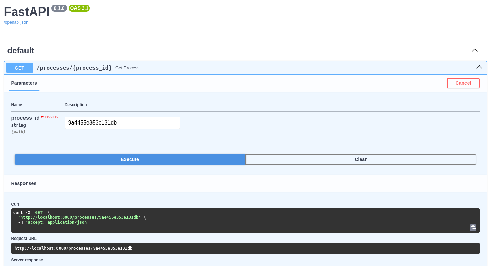

# FAIR-EASE Galaxy OGC API

The intent of this project is to create a bridge server between [Galaxy's](https://usegalaxy.org) API and [Open Geospatial Consortium APIs](https://ogc.org/publications).

## Technology Used
This  project is written in Python and currently requires Python 3.12.

## Required Libraries
- [FastAPI](https://fastapi.tiangolo.com/)
- [httpx](https://www.python-httpx.org/)

These can be installed using pip:
```bash
pip install -r requirements.txt
```


## Configuration TOML File
After cloning this repository you will need to create a file named `credentials.toml` at the root level with the following parameters set. You will then need to replace the value of `GALAXY_URL` with the galaxy URL that you use and the value of `GALAXY_ACCESS_KEY` with an API access key that you have set up under your login.

**NOTE :** `.gitignore` is already set so that this file is not synced with GitHub.

```toml
[galaxy]
GALAXY_URL = "https://usegalaxy.eu"
GALAXY_ACCESS_KEY = "<the API access ley you created under your login>"
```

## Phase 1 (FAIR-EASE Hackathon 2025-03-17 - 2025-03-21)

Explore the Galaxy API related to workflows and see how it can be interrogated in order to be served as an OGC API - Processes compliant service. The first step will be to interrogate Galaxy's API for a given workflow and search for relavent tool data to fill in the corresponding parts for describing a process compliant with the OGC API - Processes standard.

Currently, using the Swagger interface of FastAPI, you can return an OGC API - Process using a Galaxy `workflow_id`.

**Example:**

Request:



Response:

[OGC API - Processes response](./images/Screenshot-FastAPI-process-test-response.png)


### TODO
- [ ] Finish converting Galaxy workflow tool inputs to OGC `Process` inputs.
    - [ ] Debug pydantic model validation for `Process` inputs.
- [ ] Finish converting Galaxy workflow tool outputs to OGC `Process` outputs.
